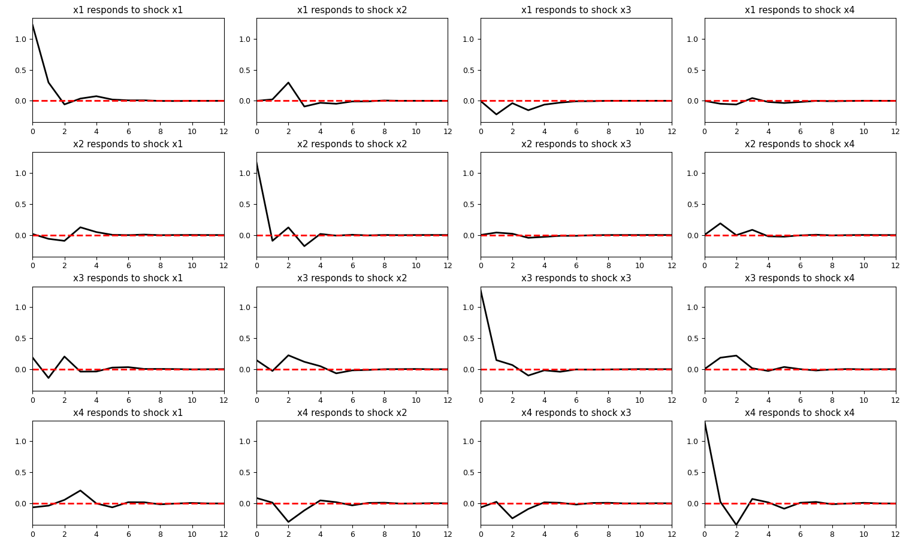

# varp


[](LICENSE)


**Author:** Tri Hoang

A Python package designed to explore Vector Autoregressive Models (VAR)

## Installation

From GitHub
```
pip install git+https://github.com/mtrihoang/varp.git
```

## Usage
Parameters

    df (pandas.core.frame.DataFrame): input time series data.
    varname (str): the selected variable to predict.
    p (int): the number of lags.
    h (int): the number of prediction steps.
    num_obs (int): the number of historical data points to display in forecast plots.

To compute impulse response functions (IRF) in VAR(p)
```
varp.irf_coefs(df, p, h)
```
To show IRF plots
```
varp.irf_plots(df, p, h)
```
To forecast h steps ahead
```
varp.pred_vars(df, p, h)
```
To show forecast plots
```
varp.pred_plots(df, varname, p, h, num_obs)
```

## Example
<pre>
>>> df
           x1        x2        x3        x4        x5
t0   0.011127  0.718911  0.331127  0.933089  0.104825
t1  -0.271037 -1.305926 -0.279659 -1.522039 -2.494281
t2  -1.028152 -1.032755  1.293889 -0.857352  0.916563
t3  -1.064529  0.757581 -0.364798  0.367727  1.674848
t4  -0.075852 -1.255148 -0.749579  0.547265  0.297691
..        ...       ...       ...       ...       ...
t95 -2.036343 -1.308089 -1.488783 -0.426856 -0.533624
t96  1.506461 -0.283629  1.275076  0.830131  0.467064
t97  0.866541 -0.033298 -1.024374 -0.083033  0.997294
t98  0.207489  1.645217  0.117577 -0.904989  0.103115
t99  1.107618 -0.609195  0.609274  0.865810  1.176038
</pre>

```
varp.irf_plots(df, p = 3, h = 12)
```

